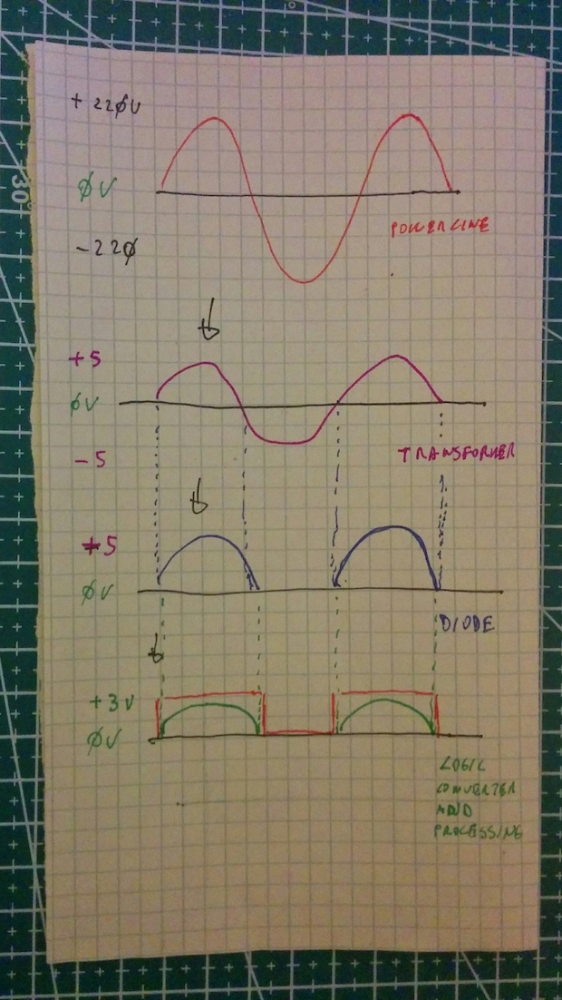

Description:
============

This program is part of an appliance to calculate statistics about 220/230V powerline main frequency (Europe) and it's intended to be compiled for NodeMCU 1.0 (ESP-12E) Modules using the Arduino's IDE. 


Hardware:
=========


I improvised the hardware using these parts I have available / recycled :

- a Wemos Lolin NodeMcu v3 module: it's a Arduino compatible platform, with embedded WIFI controller;
- a 220V -> 6V trasformer;
- a diode;
- a 5V -> 3.3V;
- a DC 5V power converter;

To measure the frequency, I converted 220V AC to 6V AC with a transformer then I filtered the negative part of AC current with a diode, obtaining ~5V of PWM.
As last step I converted the 5V PVM to 3V PWM with an IC. That level is compatible with NodeMCU logic. Measuring a seria of pulse duration the software do an estimation of the frequency:



DISCLAIMER:
===========

Electricity is dangerous: if you have no experience, please don't try this at home. 


Prerequisites:
==============

The program is compiled using Arduino IDE, version 1.8.12 (OsX version) and it's tested using the same IDE and the hardware specified in the previous paragraph. 

Installation:
=============

- Import the source code in an Arduino IDE with, at least, the specified version;
- Set the proper serial port in Tools -> Port submenu;
- Compile and Upload the program using the "upload" IDE button;
- Open the serial monitor than press the reset button on the board;
- The base URL will be printed on the serial console;

Use:
====

At the and of the installation procedure, you get the base URL, something like:

 ```shell
 http://192.168.0.1/
 ```
I suggest to reserve that IP for this use, configuring properly your router, so you haven't to connect the serial console if a different IP is negotiated.

Starting from that URL, three type of query are possible:
 1. frequency:<BR>
 ```shell
 http://192.168.0.1/frequency/
 ```
 It returns a CSV string with the average frequency in Hertz and the number of valid samples:<BR>
 ```shell
 Frequency(Hz):50.050598:45:
 ```
 The procedure try to get 50 samples, if a sample show a frequency non in the normal operationa range, it's ingored and saved as anomaly (see next point).
 2. anomalies:<BR>
 ```shell
 http://192.168.0.1/anomalies/
 ```
 It returns a CSV string with statistics on the samples non in the normal powerline's range of frequence :<BR>
 ```shell
 Anomalies:74:3:152:2:153:1:
 ```
 The CSV values are couples frequency/samples, in this example 74 Hz 3 times, 152 Hz 2 times, 153 Hz 1 time.
 3. alldata:<BR>
 ```shell
 http://192.168.0.1/alldata/
 ```
 It returns both the CSV strings described in the previous points.
 ```shell
 Frequency(Hz):50.042702:46:
 Anomalies:74:1:153:3:
 ```
